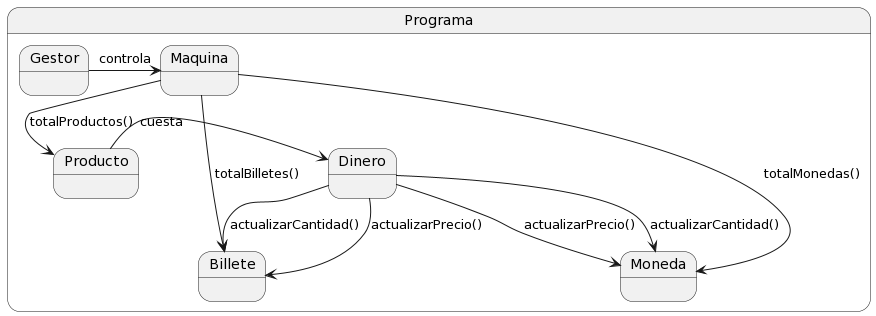

<div>
    <div align=center>
        
    </div>
    <div align=center>
        
    </div>
</div>

<a href="https://www.youtube.com/watch?v=dQw4w9WgXcQ"></a>

# <picture></picture> **Autores**

- **_Juan René Ixcopal San José_**
- **_Santiago Gómez de la Torre Romero_**

# &nbsp;**Máquinas expendedoras**

Este proyecto realiza la simulación de un sistema de máquinas expendedoras. Permite realizar compras, seleccionar productos y recibir cambio en función del dinero depositado. De igual manera cuenta con la función de que se irá restando los productos comprados, y se rellena automáticamente cuando la cantidad de productos restantes es mínima

# <b> Funcionalidades</b>

## Controllers

- **BillController**: Tiene la función createBillList que crea una lista de billetes con cantidades específicas. Permite especificar la cantidad de billetes de diferentes denominaciones y devuelve una lista de objetos BillModel

- **CoinController**: Tiene la función createCoinList que crea una lista de monedas con cantidades específicas. Permite especificar la cantidad de monedas de diferentes denominaciones y devuelve una lista de objetos CoinModel.

- **MachineController**: Permite la selección de una máquina entre las opciones disponibles. Muestra las opciones de máquinas disponibles y permite al usuario elegir una de ellas para realizar una compra utilizando el controlador PurchaseController.

- **MaintenanceController**: Tiene un método checkAndRefillProducts que verifica si la cantidad de productos en cada máquina es menor a 4. Si es así, se rellenan los productos con una cantidad de 10 unidades.

- **ProductController**: Tiene un método createProductList que crea y devuelve una lista de productos. Cada producto se instancia con un nombre, un precio y una cantidad inicial.

- **PurchaseController**: Tiene un método **purchase** que permite realizar una compra en una máquina específica. Permite seleccionar un producto de la lista de productos disponibles en la máquina, ingresar el dinero necesario y generar un ticket de compra con el producto y el cambio, si corresponde.

- **PurchaseController**: también tiene un método **selectTypeMoney** que permite seleccionar el tipo de pago, ya sea billetes o monedas.

- **PurchaseController**: Tiene un método **printTicket** que imprime un ticket de compra con el nombre del producto adquirido y, opcionalmente, el mensaje de cambio.

## Models

- **BillModel**: Es un modelo que representa un billete. Tiene un valor y una cantidad asociada. Además, implementa el método received, que permite registrar el ingreso del billete en un modelo de compra (PurchaseModel) para su posterior procesamiento

- **CoinModel**: Es un modelo que representa una moneda. Tiene un valor y una cantidad asociada. Además, implementa el método received, que permite registrar el ingreso de la moneda en un modelo de compra (PurchaseModel) para su posterior procesamiento.

- **MachineModel**: Es un modelo que representa una máquina expendedora. Tiene un nombre y contiene listas de monedas (CoinModel), billetes (BillModel) y productos (ProductModel). Permite agregar monedas, billetes y productos a la máquina, así como obtener la lista de monedas, billetes y productos disponibles en la máquina. También proporciona un método para mostrar el nombre de la máquina.

- **MaintenanceModel**: Es un modelo que representa el mantenimiento de las máquinas expendedoras. Contiene una lista de modelos de máquinas (MachineModel). Permite obtener la lista de máquinas disponibles mediante el método getMachines().

- **ProductModel**: Es un modelo que representa un producto. Contiene atributos como el nombre, el precio y la cantidad disponible. También proporciona métodos para actualizar el nombre, el precio y la cantidad del producto, así como obtener la cantidad actual mediante el método getQuantity().

- **PurchaseModel**: Contiene métodos para calcular el cambio necesario en una compra, generar un mensaje de cambio en función de los billetes y monedas disponibles, mostrar la selección de productos disponibles, seleccionar un producto y depositar dinero (tanto billetes como monedas).

# ⚙️ Instrucción de ejecución

- Asegúrate de tener Java instalado en tu sistema.
- Descarga o clona este repositorio en tu máquina local.
- Navega hasta el directorio del proyecto "awesome-projects-prograii/Mrs_Gts/src".
- Ejecuta el Main.java.

# <b> Estructura del proyecto </b>

```
├─ class-diagram/
│ └─ class.plantuml
│
├─ collaboration-diagram
│ └─ collaboration-diagram.plantuml
│
├─ domain-model/
│ └─ domain.plantuml
│
├─ images/
│ ├─ class-diagram.PNG
│ ├─ diagrama-colaboracion.png
│ ├─ domain-model.PNG
│ ├─ menu.png
│ └─ object-diagram.PNG
│
├─ object-diagram/
│ └─ objectos.plantuml
│
├─ src/
│ ├─ controllers/
│ │ ├─ BillController.java
│ │ ├─ CoinController.java
│ │ ├─ MachineController.java
│ │ ├─ ProductController.java
│ │ └─ PurchaseController.java
│ │
│ ├─ models/
│ │ ├─ BillModel.java
│ │ ├─ CoinModel.java
│ │ ├─ MachineModel.java
│ │ ├─ MaintenanceModel.java
│ │ ├─ MoneyAbstract.java
│ │ ├─ ProductModel.java
│ │ └─ PurchaseModel.java
│ │
│ ├─ test/
│ │ ├─ Test_BillController.java
│ │ ├─ Test_CoinController.java
│ │ ├─ Test_MaintenanceController.java
│ │ └─ Test_ProductController.java
│ │
│ ├─ utils/
│ │ └─ Line.java
│ │
│ └─ views/
│   ├─ MachineView.java
│   ├─ ProductView.java
│   └─  PurchaseView.java
│
└─ readme.md
```

#  Diagramas / Captura


> Modelo de dominio

<details><summary><b> Mostrar </b></summary>

|         modelo de dominio          |
| :--------------------------------: |
|  |

</details>

</br>

> Diagrama de objetos

<details><summary><b> Mostrar </b></summary>

|         diagrama de objetos          |
| :----------------------------------: |
|  |

</details>

</br>

> Diagrama de clases

<details><summary><b> Mostrar </b></summary>

|         diagrama de clases          |
| :---------------------------------: |
|  |

</details>

</br>

> Diagrama de colaboracion

<details><summary><b> Mostrar </b></summary>

|          diagrama de colaboracion           |
| :-----------------------------------------: |
|  |

</details>

</br>
